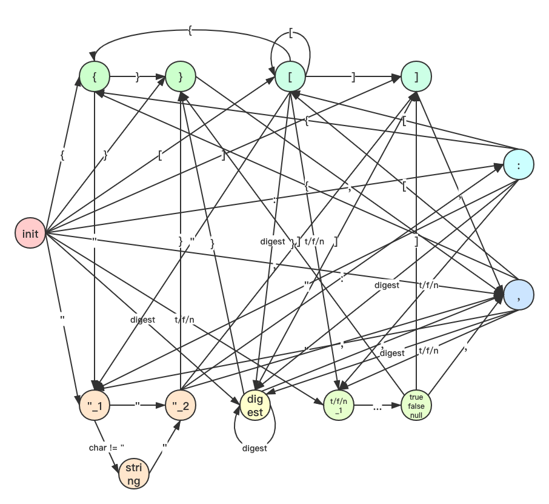

# json-deserializer

基于编译原理的一些知识简单实现了一个json反序列化器

## 词法分析：构造DFA



上图为json词法分析的DFA，图中省略了所有状态节点的另外两种情况：当遇到whitespace时回到init节点；遇到其余字符时转移到error节点。

DFA是一个有向图，有向图可以用一个三元组<当前节点，边，下个节点>表示，但是为了快速索引到当前的状态节点，所以决定用一个Map<当前节点，<边，下个节点>>来存储。

`com.shildon.json.deserializer.Dfa`为该DFA的具体实现，基于kotlin的infix function，可以直观的实现DFA的初始化：

```kotlin
// from initial state
DfaState.INITIAL meet { it == '"' } go DfaState.STRING_LITERAL_BEGIN,
DfaState.INITIAL meet { it.isDigit() } go DfaState.NUMBER_LITERAL,
DfaState.INITIAL meet { it == 't' } go DfaState.TRUE_LITERAL_1,
DfaState.INITIAL meet { it == 'f' } go DfaState.FALSE_LITERAL_1,
DfaState.INITIAL meet { it == 'n' } go DfaState.NULL_LITERAL_1,
DfaState.INITIAL meet { it == '{' } go DfaState.LEFT_BRACE,
DfaState.INITIAL meet { it == '}' } go DfaState.RIGHT_BRACE,
DfaState.INITIAL meet { it == '[' } go DfaState.LEFT_BRACKET,
DfaState.INITIAL meet { it == ']' } go DfaState.RIGHT_BRACKET,
DfaState.INITIAL meet { it == ':' } go DfaState.COLON,
DfaState.INITIAL meet { it == ',' } go DfaState.COMMA,
DfaState.INITIAL meet { it.isWhitespace() } go DfaState.INITIAL,
```

上图展示的kotlin代码片段，meet和go都是infix function，该片段初始化了init节点的转移过程，如第一行表示INITIAL（init）节点遇到"字符转移到STRING_LITERAL_BEGIN（"_1）节点。

然后提供了next方法：`fun next(currentState: DfaState, char: Char): DfaState`，根据当前状态和字符，输出下一个状态。

```kotlin
fun next(currentState: DfaState, char: Char): DfaState =
    transferMap[currentState]
            ?.firstOrNull { it.first.test(char) }
            ?.second
            ?: DfaState.ERROR
```

在词法分析器中，每转移一个状态节点，就往token里面加入当前字符，当转移到不同状态时，表示当前token已经拼接完成，所以需要把token取出放到list中，同时创建一个新的token。具体实现在`com.shildon.json.deserializer.JsonLexer`

```kotlin
private fun tokenize(bufferedReader: BufferedReader): TokenReader {
    val charBuffer = CharBuffer.allocate(128)
    var state = DfaState.INITIAL
    var line = 1
    while (bufferedReader.read(charBuffer) != -1) {
        charBuffer.flip()
        while (charBuffer.hasRemaining()) {
            val char = charBuffer.get()
            val currentState = state
            val nextState = Dfa.next(currentState, char)
            state = nextState

            if (!currentState.isSame(nextState)) {
                applyToken(currentState, line)
                extractToken()
            }

            if (nextState == DfaState.ERROR) {
                throwException()
            }
            if (nextState != DfaState.INITIAL) {
                appendText(char)
            }
            if (char.isLineBreak()) {
                line++
            }
        }
        charBuffer.clear()
    }
    applyToken(state, line)
    extractToken()
    return TokenReader(LinkedList(tokens))
}
```

## 语法分析：自顶向下递归构造AST

json的语法相对节点，对应的产生式如下：

```
json -> object | array
object -> '{' object_members? '}'
object_members -> key_value object_member? | eps
object_members' -> ',' key_value object_members'? | eps
array -> '[' array_members? ']'
array_members -> value array_member? | eps
array_members' -> ',' value array_members'? | eps
key_value -> string ':' value
value -> string | number | true | false | object | array | null | esp
```

基于这些语法的产生式，我们就通过自顶向下的递归构建算法，来构建出一棵AST。
